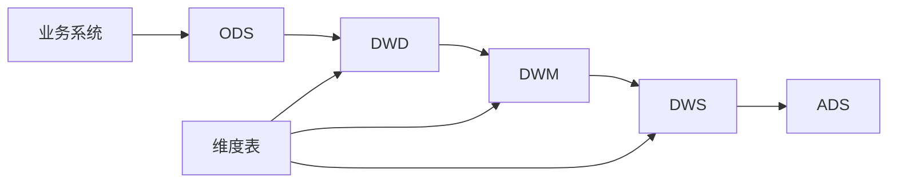

# 销售数据仓库设计文档

## 目录
- [1. 数据架构概述](#1-数据架构概述)
- [2. 数据域规划](#2-数据域规划)
- [3. 主题域规划](#3-主题域规划)
- [4. 维度设计](#4-维度设计)
- [5. 数据标准](#5-数据标准)
- [6. 分层设计](#6-分层设计)
- [7. 数据模型](#7-数据模型)
- [8. 数据生命周期](#8-数据生命周期)

## 1. 数据架构概述

### 1.1 分层架构
- **ODS**（Operation Data Store）：原始数据层，存储来自业务系统的原始数据
- **DWD**（Data Warehouse Detail）：明细数据层，存储业务过程的明细数据
- **DWM**（Data Warehouse Middle）：中间层，存储业务过程的中间结果
- **DWS**（Data Warehouse Service）：服务层，存储业务过程的汇总数据
- **ADS**（Application Data Service）：应用层，存储面向应用的统计数据

### 1.2 数据流转


## 2. 数据域规划

### 2.1 交易域
- 订单交易
- 支付流水
- 退款管理
- 交易流程

### 2.2 商品域
- 商品信息
- 类目体系
- 库存管理
- 价格体系

### 2.3 用户域
- 用户信息
- 会员体系
- 用户行为
- 用户画像

### 2.4 供应链域
- 供应商管理
- 仓储物流
- 采购管理
- 库存周转

### 2.5 营销域
- 促销活动
- 优惠券
- 营销效果
- 用户触达

## 3. 主题域规划

### 3.1 交易主题
- 订单链路
- 支付链路
- 退款链路
- 物流链路

### 3.2 商品主题
- 商品生命周期
- 商品类目体系
- 价格体系
- 库存管理

### 3.3 用户主题
- 用户基础画像
- 用户行为分析
- 用户价值分析
- 会员成长体系

### 3.4 供应链主题
- 供应商管理
- 采购管理
- 仓储管理
- 物流配送

### 3.5 营销主题
- 活动管理
- 优惠券管理
- 营销效果
- 用户运营

## 4. 维度设计

### 4.1 时间维度
- 日期
- 时间
- 季节
- 节假日

### 4.2 地理维度
- 国家
- 省份
- 城市
- 区域

### 4.3 用户维度
- 用户类型
- 年龄段
- 会员等级
- 消费能力

### 4.4 商品维度
- 品类
- 品牌
- 价格区间
- 商品状态

## 5. 数据标准

### 5.1 命名规范

#### 5.1.1 表命名规范
- **ODS层**：`ods_{业务数据库名}_{业务数据表名}_{存储策略}`
- **DWD层**：`dwd_{一级数据域}_{二级数据域}_{业务过程}_{存储策略}`
- **DWM层**：`dwm_{一级数据域}_{业务过程}_{存储策略}`
- **DWS层**：`dws_{一级数据域}_{二级数据域}_{颗粒度}_{业务过程}_{周期}`
- **ADS层**：`ads_{一级应用主题}_{二级应用主题}_{颗粒度}_{业务过程}`
- **维度表**：`dim_{维度定义}_{存储策略}`
- **临时表**：`tmp_{表名}_{临时表编号}`
- **视图**：`view_{表名}`
- **备份表**：`{表名}_bak`

#### 5.1.2 字段命名规范
- **是否类型**：`is_{内容}`
- **枚举类型**：`{字段}_type`
- **时间类型**：`{字段}_date`, `{字段}_time`
- **百分比**：`{维度}_{指标}_rate_{周期}`
- **金额（小数）**：`{维度}_{指标}_amt_{周期}`
- **数量（整数）**：`{维度}_{指标}_cnt_{周期}`
- **最近一次**：`{维度}_{指标}_{类型}_last1`
- **时间间隔**：`{时间段1}_{时间段2}_dur`

### 5.2 存储策略
- **df**：日全量
- **di**：日增量
- **hf**：小时全量
- **hi**：小时增量

### 5.3 字段类型规范
- **文本**：string
- **日期**：string
- **整数**：bigint
- **小数**：
  - 高精度金额：decimal(16,2)
  - 一般精度：double
- **枚举值**：
  - 单枚举：bigint(1/0)
  - 多枚举：string
- **ID类型**：string

## 6. 分层设计

### 6.1 ODS层
- 保持原始数据不做处理
- 按天分区存储
- 保留历史变更记录

### 6.2 DWD层
- 数据清洗转换
- 维度退化处理
- 一致性处理

### 6.3 DWM层
- 轻度汇总
- 通用中间层
- 重复使用高

### 6.4 DWS层
- 按主题汇总
- 跨主题统计
- 预聚合处理

### 6.5 ADS层
- 面向应用
- 指标统计
- 报表数据

## 7. 数据模型

### 7.1 ODS层模型

#### 7.1.1 用户域
```sql
-- 用户基础信息表
CREATE TABLE ods_mysql_users_df (
    user_id string COMMENT '用户ID',
    username string COMMENT '用户名',
    email string COMMENT '邮箱',
    phone string COMMENT '手机号',
    password string COMMENT '密码',
    nickname string COMMENT '昵称',
    avatar_url string COMMENT '头像URL',
    status string COMMENT '账户状态',
    is_verified bigint COMMENT '是否已验证',
    role string COMMENT '用户角色',
    created_at string COMMENT '创建时间',
    updated_at string COMMENT '更新时间',
    last_login string COMMENT '最后登录时间',
    account_balance decimal(16,2) COMMENT '账户余额',
    points_balance bigint COMMENT '积分余额',
    membership_level string COMMENT '会员等级',
    failed_attempts bigint COMMENT '登录失败次数',
    lock_until string COMMENT '锁定时间',
    two_factor_enabled bigint COMMENT '是否启用双因素认证',
    preferred_language string COMMENT '语言偏好',
    preferred_currency string COMMENT '货币偏好',
    shipping_address string COMMENT '收货地址',
    billing_address string COMMENT '账单地址',
    newsletter_subscribed bigint COMMENT '是否订阅邮件',
    referral_code string COMMENT '推荐码',
    referred_by_user_id string COMMENT '推荐人ID',
    cart_id string COMMENT '购物车ID',
    order_count bigint COMMENT '订单数量',
    order_total decimal(16,2) COMMENT '消费总额'
)
COMMENT '用户基础信息表'
PARTITIONED BY (dt string)
STORED AS PARQUET;

-- 用户登录日志表
CREATE TABLE ods_mysql_user_login_di (
    log_id string COMMENT '日志ID',
    user_id string COMMENT '用户ID',
    login_time string COMMENT '登录时间',
    login_type string COMMENT '登录类型',
    device_type string COMMENT '设备类型',
    ip_address string COMMENT 'IP地址',
    location string COMMENT '登录地点',
    is_success bigint COMMENT '是否登录成功',
    fail_reason string COMMENT '失败原因',
    user_agent string COMMENT '用户代理',
    session_id string COMMENT '会话ID'
)
COMMENT '用户登录日志表'
PARTITIONED BY (dt string)
STORED AS PARQUET;

-- 会员积分表
CREATE TABLE ods_mysql_member_points_df (
    point_id string COMMENT '积分ID',
    user_id string COMMENT '用户ID',
    point_type string COMMENT '积分类型',
    point_value bigint COMMENT '积分值',
    expire_time string COMMENT '过期时间',
    is_expired bigint COMMENT '是否已过期',
    create_time string COMMENT '创建时间',
    description string COMMENT '积分描述',
    source string COMMENT '积分来源',
    transaction_id string COMMENT '关联交易ID'
)
COMMENT '会员积分表'
PARTITIONED BY (dt string)
STORED AS PARQUET;
```

#### 7.1.2 商品域
```sql
-- 商品信息表
CREATE TABLE ods_mysql_products_df (
    product_id string COMMENT '商品ID',
    product_name string COMMENT '商品名称',
    product_code string COMMENT '商品编码',
    brand_id string COMMENT '品牌ID',
    brand_name string COMMENT '品牌名称',
    category_id string COMMENT '类目ID',
    category_name string COMMENT '类目名称',
    subcategory_id string COMMENT '子类目ID',
    subcategory_name string COMMENT '子类目名称',
    description string COMMENT '商品描述',
    price_amt decimal(16,2) COMMENT '售价',
    cost_amt decimal(16,2) COMMENT '成本价',
    market_price decimal(16,2) COMMENT '市场价',
    discount_rate decimal(16,2) COMMENT '折扣率',
    weight decimal(16,2) COMMENT '重量',
    volume decimal(16,2) COMMENT '体积',
    unit string COMMENT '单位',
    specifications string COMMENT '规格参数',
    shelf_life bigint COMMENT '保质期(天)',
    storage_conditions string COMMENT '存储条件',
    is_valid bigint COMMENT '是否有效',
    shelf_status string COMMENT '上下架状态',
    sales_count bigint COMMENT '销量',
    rating decimal(16,2) COMMENT '评分',
    review_count bigint COMMENT '评价数',
    create_time string COMMENT '创建时间',
    update_time string COMMENT '更新时间'
)
COMMENT '商品信息表'
PARTITIONED BY (dt string)
STORED AS PARQUET;

-- 商品类目表
CREATE TABLE ods_mysql_product_category_df (
    category_id string COMMENT '类目ID',
    category_name string COMMENT '类目名称',
    parent_id string COMMENT '父类目ID',
    category_level bigint COMMENT '类目层级',
    category_path string COMMENT '类目路径',
    is_leaf bigint COMMENT '是否叶子节点',
    sort_order bigint COMMENT '排序号',
    icon_url string COMMENT '图标URL',
    description string COMMENT '类目描述',
    is_valid bigint COMMENT '是否有效',
    create_time string COMMENT '创建时间',
    update_time string COMMENT '更新时间'
)
COMMENT '商品类目表'
PARTITIONED BY (dt string)
STORED AS PARQUET;

-- 商品库存表
CREATE TABLE ods_mysql_product_inventory_df (
    inventory_id string COMMENT '库存ID',
    product_id string COMMENT '商品ID',
    warehouse_id string COMMENT '仓库ID',
    warehouse_name string COMMENT '仓库名称',
    available_qty bigint COMMENT '可用库存',
    locked_qty bigint COMMENT '锁定库存',
    total_qty bigint COMMENT '总库存',
    alert_qty bigint COMMENT '预警库存',
    cost_amt decimal(16,2) COMMENT '库存成本',
    shelf_position string COMMENT '货架位置',
    batch_no string COMMENT '批次号',
    production_date string COMMENT '生产日期',
    expiry_date string COMMENT '过期日期',
    quality_status string COMMENT '质量状态',
    update_time string COMMENT '更新时间'
)
COMMENT '商品库存表'
PARTITIONED BY (dt string)
STORED AS PARQUET;

-- 品牌信息表
CREATE TABLE ods_mysql_brand_info_df (
    brand_id string COMMENT '品牌ID',
    brand_name string COMMENT '品牌名称',
    brand_english_name string COMMENT '品牌英文名',
    logo_url string COMMENT '品牌LOGO',
    description string COMMENT '品牌描述',
    country string COMMENT '品牌国家',
    company string COMMENT '所属公司',
    website string COMMENT '官网',
    contact_phone string COMMENT '联系电话',
    contact_email string COMMENT '联系邮箱',
    founded_year string COMMENT '成立年份',
    status string COMMENT '品牌状态',
    is_valid bigint COMMENT '是否有效',
    create_time string COMMENT '创建时间',
    update_time string COMMENT '更新时间'
)
COMMENT '品牌信息表'
PARTITIONED BY (dt string)
STORED AS PARQUET;
```

#### 7.1.3 交易域
```sql
-- 订单主表
CREATE TABLE ods_mysql_orders_df (
    order_id string COMMENT '订单ID',
    order_no string COMMENT '订单编号',
    user_id string COMMENT '用户ID',
    order_status string COMMENT '订单状态',
    order_type string COMMENT '订单类型',
    payment_type string COMMENT '支付方式',
    total_amt decimal(16,2) COMMENT '订单总金额',
    actual_amt decimal(16,2) COMMENT '实付金额',
    freight_amt decimal(16,2) COMMENT '运费',
    discount_amt decimal(16,2) COMMENT '优惠金额',
    coupon_amt decimal(16,2) COMMENT '优惠券金额',
    points_amt decimal(16,2) COMMENT '积分抵扣金额',
    tax_amt decimal(16,2) COMMENT '税费',
    shipping_name string COMMENT '收货人姓名',
    shipping_phone string COMMENT '收货人电话',
    shipping_address string COMMENT '收货地址',
    shipping_province string COMMENT '省份',
    shipping_city string COMMENT '城市',
    shipping_district string COMMENT '区县',
    shipping_postal_code string COMMENT '邮编',
    delivery_type string COMMENT '配送方式',
    delivery_company string COMMENT '快递公司',
    tracking_no string COMMENT '快递单号',
    buyer_notes string COMMENT '买家备注',
    seller_notes string COMMENT '卖家备注',
    create_time string COMMENT '创建时间',
    payment_time string COMMENT '支付时间',
    delivery_time string COMMENT '发货时间',
    receive_time string COMMENT '收货时间',
    finish_time string COMMENT '完成时间',
    cancel_time string COMMENT '取消时间',
    cancel_reason string COMMENT '取消原因',
    source string COMMENT '订单来源',
    platform string COMMENT '下单平台',
    is_reviewed bigint COMMENT '是否已评价'
)
COMMENT '订单主表'
PARTITIONED BY (dt string)
STORED AS PARQUET;

-- 订单明细表
CREATE TABLE ods_mysql_order_items_df (
    order_item_id string COMMENT '订单项ID',
    order_id string COMMENT '订单ID',
    product_id string COMMENT '商品ID',
    product_name string COMMENT '商品名称',
    product_code string COMMENT '商品编码',
    product_category_id string COMMENT '商品类目ID',
    brand_id string COMMENT '品牌ID',
    sku_id string COMMENT 'SKU ID',
    sku_code string COMMENT 'SKU编码',
    sku_name string COMMENT 'SKU名称',
    quantity bigint COMMENT '数量',
    unit_price decimal(16,2) COMMENT '单价',
    original_price decimal(16,2) COMMENT '原价',
    total_amt decimal(16,2) COMMENT '总金额',
    discount_amt decimal(16,2) COMMENT '优惠金额',
    actual_amt decimal(16,2) COMMENT '实付金额',
    is_gift bigint COMMENT '是否赠品',
    gift_type string COMMENT '赠品类型',
    promotion_id string COMMENT '促销活动ID',
    promotion_name string COMMENT '促销活动名称',
    points_awarded bigint COMMENT '赠送积分',
    commission_rate decimal(16,2) COMMENT '佣金比例',
    commission_amt decimal(16,2) COMMENT '佣金金额',
    create_time string COMMENT '创建时间',
    update_time string COMMENT '更新时间'
)
COMMENT '订单明细表'
PARTITIONED BY (dt string)
STORED AS PARQUET;

-- 支付流水表
CREATE TABLE ods_mysql_payment_flow_di (
    payment_id string COMMENT '支付ID',
    order_id string COMMENT '订单ID',
    user_id string COMMENT '用户ID',
    payment_type string COMMENT '支付方式',
    transaction_no string COMMENT '交易流水号',
    payment_status string COMMENT '支付状态',
    payment_amt decimal(16,2) COMMENT '支付金额',
    currency string COMMENT '支付币种',
    exchange_rate decimal(16,4) COMMENT '汇率',
    payment_channel string COMMENT '支付渠道',
    payment_gateway string COMMENT '支付网关',
    bank_code string COMMENT '银行编码',
    bank_name string COMMENT '银行名称',
    card_type string COMMENT '卡类型',
    card_no string COMMENT '卡号后四位',
    payment_time string COMMENT '支付时间',
    complete_time string COMMENT '完成时间',
    fail_reason string COMMENT '失败原因',
    device_type string COMMENT '设备类型',
    ip_address string COMMENT 'IP地址',
    location string COMMENT '支付地点',
    create_time string COMMENT '创建时间',
    update_time string COMMENT '更新时间'
)
COMMENT '支付流水表'
PARTITIONED BY (dt string)
STORED AS PARQUET;

-- 退款流水表
CREATE TABLE ods_mysql_refund_flow_di (
    refund_id string COMMENT '退款ID',
    order_id string COMMENT '订单ID',
    payment_id string COMMENT '支付ID',
    user_id string COMMENT '用户ID',
    refund_no string COMMENT '退款编号',
    refund_type string COMMENT '退款类型',
    refund_status string COMMENT '退款状态',
    refund_amt decimal(16,2) COMMENT '退款金额',
    refund_reason string COMMENT '退款原因',
    refund_desc string COMMENT '退款说明',
    proof_urls string COMMENT '凭证图片',
    apply_time string COMMENT '申请时间',
    audit_time string COMMENT '审核时间',
    complete_time string COMMENT '完成时间',
    auditor_id string COMMENT '审核人ID',
    fail_reason string COMMENT '失败原因',
    create_time string COMMENT '创建时间',
    update_time string COMMENT '更新时间'
)
COMMENT '退款流水表'
PARTITIONED BY (dt string)
STORED AS PARQUET;
```

### 7.2 DWD层模型

#### 7.2.1 交易域
```sql
-- 订单事实表
CREATE TABLE dwd_fact_order_df (
    order_id string COMMENT '订单ID',
    order_no string COMMENT '订单编号',
    user_id string COMMENT '用户ID',
    order_status string COMMENT '订单状态',
    order_type string COMMENT '订单类型',
    payment_type string COMMENT '支付方式',
    total_amt decimal(16,2) COMMENT '订单总金额',
    actual_amt decimal(16,2) COMMENT '实付金额',
    freight_amt decimal(16,2) COMMENT '运费',
    discount_amt decimal(16,2) COMMENT '优惠金额',
    coupon_amt decimal(16,2) COMMENT '优惠券金额',
    points_amt decimal(16,2) COMMENT '积分抵扣金额',
    tax_amt decimal(16,2) COMMENT '税费',
    province_id string COMMENT '省份ID',
    province_name string COMMENT '省份名称',
    city_id string COMMENT '城市ID',
    city_name string COMMENT '城市名称',
    district_id string COMMENT '区县ID',
    district_name string COMMENT '区县名称',
    delivery_type string COMMENT '配送方式',
    delivery_company string COMMENT '快递公司',
    source string COMMENT '订单来源',
    platform string COMMENT '下单平台',
    is_reviewed bigint COMMENT '是否已评价',
    create_time string COMMENT '创建时间',
    payment_time string COMMENT '支付时间',
    delivery_time string COMMENT '发货时间',
    receive_time string COMMENT '收货时间',
    finish_time string COMMENT '完成时间',
    cancel_time string COMMENT '取消时间',
    cancel_reason string COMMENT '取消原因'
)
COMMENT '订单事实表'
PARTITIONED BY (dt string)
STORED AS PARQUET;

-- 订单明细事实表
CREATE TABLE dwd_fact_order_item_df (
    order_item_id string COMMENT '订单项ID',
    order_id string COMMENT '订单ID',
    product_id string COMMENT '商品ID',
    product_name string COMMENT '商品名称',
    product_code string COMMENT '商品编码',
    category_id string COMMENT '类目ID',
    category_name string COMMENT '类目名称',
    brand_id string COMMENT '品牌ID',
    brand_name string COMMENT '品牌名称',
    sku_id string COMMENT 'SKU ID',
    sku_code string COMMENT 'SKU编码',
    sku_name string COMMENT 'SKU名称',
    quantity bigint COMMENT '数量',
    unit_price decimal(16,2) COMMENT '单价',
    original_price decimal(16,2) COMMENT '原价',
    total_amt decimal(16,2) COMMENT '总金额',
    discount_amt decimal(16,2) COMMENT '优惠金额',
    actual_amt decimal(16,2) COMMENT '实付金额',
    is_gift bigint COMMENT '是否赠品',
    gift_type string COMMENT '赠品类型',
    promotion_id string COMMENT '促销活动ID',
    promotion_name string COMMENT '促销活动名称',
    points_awarded bigint COMMENT '赠送积分',
    commission_rate decimal(16,2) COMMENT '佣金比例',
    commission_amt decimal(16,2) COMMENT '佣金金额',
    create_time string COMMENT '创建时间'
)
COMMENT '订单明细事实表'
PARTITIONED BY (dt string)
STORED AS PARQUET;

-- 支付事实表
CREATE TABLE dwd_fact_payment_di (
    payment_id string COMMENT '支付ID',
    order_id string COMMENT '订单ID',
    user_id string COMMENT '用户ID',
    payment_type string COMMENT '支付方式',
    transaction_no string COMMENT '交易流水号',
    payment_status string COMMENT '支付状态',
    payment_amt decimal(16,2) COMMENT '支付金额',
    currency string COMMENT '支付币种',
    exchange_rate decimal(16,4) COMMENT '汇率',
    payment_channel string COMMENT '支付渠道',
    payment_gateway string COMMENT '支付网关',
    bank_code string COMMENT '银行编码',
    bank_name string COMMENT '银行名称',
    card_type string COMMENT '卡类型',
    card_no string COMMENT '卡号后四位',
    device_type string COMMENT '设备类型',
    os_type string COMMENT '操作系统',
    ip_address string COMMENT 'IP地址',
    location string COMMENT '支付地点',
    is_success bigint COMMENT '是否成功',
    fail_reason string COMMENT '失败原因',
    payment_time string COMMENT '支付时间',
    complete_time string COMMENT '完成时间'
)
COMMENT '支付事实表'
PARTITIONED BY (dt string)
STORED AS PARQUET;

-- 退款事实表
CREATE TABLE dwd_fact_refund_di (
    refund_id string COMMENT '退款ID',
    order_id string COMMENT '订单ID',
    payment_id string COMMENT '支付ID',
    user_id string COMMENT '用户ID',
    refund_no string COMMENT '退款编号',
    refund_type string COMMENT '退款类型',
    refund_status string COMMENT '退款状态',
    refund_amt decimal(16,2) COMMENT '退款金额',
    refund_reason string COMMENT '退款原因',
    refund_desc string COMMENT '退款说明',
    proof_urls string COMMENT '凭证图片',
    apply_time string COMMENT '申请时间',
    audit_time string COMMENT '审核时间',
    complete_time string COMMENT '完成时间',
    auditor_id string COMMENT '审核人ID',
    fail_reason string COMMENT '失败原因'
)
COMMENT '退款事实表'
PARTITIONED BY (dt string)
STORED AS PARQUET;
```

#### 7.2.2 用户域
```sql
-- 用户行为事实表
CREATE TABLE dwd_fact_user_behavior_di (
    behavior_id string COMMENT '行为ID',
    user_id string COMMENT '用户ID',
    behavior_type string COMMENT '行为类型',
    item_id string COMMENT '对象ID',
    item_type string COMMENT '对象类型',
    behavior_time string COMMENT '行为时间',
    device_type string COMMENT '设备类型',
    os_type string COMMENT '操作系统',
    browser_type string COMMENT '浏览器类型',
    ip_address string COMMENT 'IP地址',
    location string COMMENT '地理位置',
    session_id string COMMENT '会话ID',
    page_id string COMMENT '页面ID',
    page_url string COMMENT '页面URL',
    stay_time bigint COMMENT '停留时间(秒)',
    is_new_user bigint COMMENT '是否新用户',
    referrer_type string COMMENT '来源类型',
    referrer_url string COMMENT '来源URL',
    utm_source string COMMENT '广告来源',
    utm_medium string COMMENT '广告媒介',
    utm_campaign string COMMENT '广告系列',
    utm_content string COMMENT '广告内容',
    utm_term string COMMENT '广告关键词'
)
COMMENT '用户行为事实表'
PARTITIONED BY (dt string)
STORED AS PARQUET;

-- 用户登录事实表
CREATE TABLE dwd_fact_user_login_di (
    login_id string COMMENT '登录ID',
    user_id string COMMENT '用户ID',
    login_type string COMMENT '登录类型',
    login_status string COMMENT '登录状态',
    login_time string COMMENT '登录时间',
    device_type string COMMENT '设备类型',
    os_type string COMMENT '操作系统',
    browser_type string COMMENT '浏览器类型',
    ip_address string COMMENT 'IP地址',
    location string COMMENT '地理位置',
    is_success bigint COMMENT '是否成功',
    fail_reason string COMMENT '失败原因',
    session_id string COMMENT '会话ID',
    user_agent string COMMENT '用户代理',
    is_risk bigint COMMENT '是否风险登录',
    risk_level string COMMENT '风险等级',
    risk_reason string COMMENT '风险原因'
)
COMMENT '用户登录事实表'
PARTITIONED BY (dt string)
STORED AS PARQUET;
```

### 7.3 DWM层模型

#### 7.3.1 用户域
```sql
-- 用户交易汇总表(最近30天)
CREATE TABLE dws_user_trade_30d_df (
    user_id string COMMENT '用户ID',
    order_count bigint COMMENT '订单数',
    order_amt decimal(16,2) COMMENT '订单金额',
    actual_amt decimal(16,2) COMMENT '实付金额',
    discount_amt decimal(16,2) COMMENT '优惠金额',
    coupon_amt decimal(16,2) COMMENT '优惠券金额',
    points_amt decimal(16,2) COMMENT '积分抵扣金额',
    avg_order_amt decimal(16,2) COMMENT '平均订单金额',
    max_order_amt decimal(16,2) COMMENT '最大订单金额',
    min_order_amt decimal(16,2) COMMENT '最小订单金额',
    product_count bigint COMMENT '购买商品数',
    category_count bigint COMMENT '购买类目数',
    brand_count bigint COMMENT '购买品牌数',
    last_order_time string COMMENT '最后下单时间',
    order_cycle decimal(16,2) COMMENT '下单周期(天)',
    payment_count bigint COMMENT '支付次数',
    payment_amt decimal(16,2) COMMENT '支付金额',
    refund_count bigint COMMENT '退款次数',
    refund_amt decimal(16,2) COMMENT '退款金额',
    points_awarded bigint COMMENT '获得积分',
    points_used bigint COMMENT '使用积分'
)
COMMENT '用户交易汇总表(最近30天)'
PARTITIONED BY (dt string)
STORED AS PARQUET;

-- 用户行为汇总表(最近30天)
CREATE TABLE dws_user_behavior_30d_df (
    user_id string COMMENT '用户ID',
    visit_count bigint COMMENT '访问次数',
    total_stay_time bigint COMMENT '总停留时间(秒)',
    avg_stay_time decimal(16,2) COMMENT '平均停留时间(秒)',
    page_view_count bigint COMMENT '页面浏览数',
    unique_page_count bigint COMMENT '唯一页面数',
    bounce_count bigint COMMENT '跳出次数',
    bounce_rate decimal(16,4) COMMENT '跳出率',
    cart_count bigint COMMENT '加购次数',
    cart_amount decimal(16,2) COMMENT '加购金额',
    wishlist_count bigint COMMENT '收藏次数',
    search_count bigint COMMENT '搜索次数',
    click_count bigint COMMENT '点击次数',
    last_visit_time string COMMENT '最后访问时间',
    visit_days bigint COMMENT '访问天数',
    device_type_ratio string COMMENT '设备类型分布',
    source_type_ratio string COMMENT '来源类型分布',
    browser_type_ratio string COMMENT '浏览器类型分布',
    province_ratio string COMMENT '省份分布',
    city_ratio string COMMENT '城市分布'
)
COMMENT '用户行为汇总表(最近30天)'
PARTITIONED BY (dt string)
STORED AS PARQUET;
```

#### 7.3.2 商品域
```sql
-- 商品交易汇总表(最近30天)
CREATE TABLE dws_product_trade_30d_df (
    product_id string COMMENT '商品ID',
    order_count bigint COMMENT '订单数',
    order_amt decimal(16,2) COMMENT '订单金额',
    actual_amt decimal(16,2) COMMENT '实付金额',
    discount_amt decimal(16,2) COMMENT '优惠金额',
    user_count bigint COMMENT '购买用户数',
    new_user_count bigint COMMENT '新用户数',
    quantity bigint COMMENT '销售数量',
    avg_price decimal(16,2) COMMENT '平均售价',
    avg_discount_rate decimal(16,4) COMMENT '平均折扣率',
    refund_count bigint COMMENT '退款次数',
    refund_amt decimal(16,2) COMMENT '退款金额',
    refund_rate decimal(16,4) COMMENT '退款率',
    cart_count bigint COMMENT '加购次数',
    cart_user_count bigint COMMENT '加购用户数',
    wishlist_count bigint COMMENT '收藏次数',
    wishlist_user_count bigint COMMENT '收藏用户数',
    review_count bigint COMMENT '评价数',
    good_review_count bigint COMMENT '好评数',
    bad_review_count bigint COMMENT '差评数',
    review_rate decimal(16,4) COMMENT '评价率',
    good_review_rate decimal(16,4) COMMENT '好评率'
)
COMMENT '商品交易汇总表(最近30天)'
PARTITIONED BY (dt string)
STORED AS PARQUET;

-- 品类交易汇总表(最近30天)
CREATE TABLE dws_category_trade_30d_df (
    category_id string COMMENT '类目ID',
    category_name string COMMENT '类目名称',
    order_count bigint COMMENT '订单数',
    order_amt decimal(16,2) COMMENT '订单金额',
    actual_amt decimal(16,2) COMMENT '实付金额',
    discount_amt decimal(16,2) COMMENT '优惠金额',
    user_count bigint COMMENT '购买用户数',
    new_user_count bigint COMMENT '新用户数',
    quantity bigint COMMENT '销售数量',
    product_count bigint COMMENT '商品数',
    avg_price decimal(16,2) COMMENT '平均售价',
    avg_discount_rate decimal(16,4) COMMENT '平均折扣率',
    refund_count bigint COMMENT '退款次数',
    refund_amt decimal(16,2) COMMENT '退款金额',
    refund_rate decimal(16,4) COMMENT '退款率',
    cart_count bigint COMMENT '加购次数',
    cart_user_count bigint COMMENT '加购用户数',
    review_count bigint COMMENT '评价数',
    good_review_rate decimal(16,4) COMMENT '好评率'
)
COMMENT '品类交易汇总表(最近30天)'
PARTITIONED BY (dt string)
STORED AS PARQUET;

-- 品牌交易汇总表(最近30天)
CREATE TABLE dws_brand_trade_30d_df (
    brand_id string COMMENT '品牌ID',
    brand_name string COMMENT '品牌名称',
    order_count bigint COMMENT '订单数',
    order_amt decimal(16,2) COMMENT '订单金额',
    actual_amt decimal(16,2) COMMENT '实付金额',
    discount_amt decimal(16,2) COMMENT '优惠金额',
    user_count bigint COMMENT '购买用户数',
    new_user_count bigint COMMENT '新用户数',
    quantity bigint COMMENT '销售数量',
    product_count bigint COMMENT '商品数',
    avg_price decimal(16,2) COMMENT '平均售价',
    avg_discount_rate decimal(16,4) COMMENT '平均折扣率',
    refund_count bigint COMMENT '退款次数',
    refund_amt decimal(16,2) COMMENT '退款金额',
    refund_rate decimal(16,4) COMMENT '退款率',
    cart_count bigint COMMENT '加购次数',
    cart_user_count bigint COMMENT '加购用户数',
    review_count bigint COMMENT '评价数',
    good_review_rate decimal(16,4) COMMENT '好评率'
)
COMMENT '品牌交易汇总表(最近30天)'
PARTITIONED BY (dt string)
STORED AS PARQUET;
```

### 7.4 DWS层模型

#### 7.4.1 用户域
```sql
-- 用户交易汇总表(最近30天)
CREATE TABLE dws_user_trade_30d_df (
    user_id string COMMENT '用户ID',
    order_count bigint COMMENT '订单数',
    order_amt decimal(16,2) COMMENT '订单金额',
    actual_amt decimal(16,2) COMMENT '实付金额',
    discount_amt decimal(16,2) COMMENT '优惠金额',
    coupon_amt decimal(16,2) COMMENT '优惠券金额',
    points_amt decimal(16,2) COMMENT '积分抵扣金额',
    avg_order_amt decimal(16,2) COMMENT '平均订单金额',
    max_order_amt decimal(16,2) COMMENT '最大订单金额',
    min_order_amt decimal(16,2) COMMENT '最小订单金额',
    product_count bigint COMMENT '购买商品数',
    category_count bigint COMMENT '购买类目数',
    brand_count bigint COMMENT '购买品牌数',
    last_order_time string COMMENT '最后下单时间',
    order_cycle decimal(16,2) COMMENT '下单周期(天)',
    payment_count bigint COMMENT '支付次数',
    payment_amt decimal(16,2) COMMENT '支付金额',
    refund_count bigint COMMENT '退款次数',
    refund_amt decimal(16,2) COMMENT '退款金额',
    points_awarded bigint COMMENT '获得积分',
    points_used bigint COMMENT '使用积分'
)
COMMENT '用户交易汇总表(最近30天)'
PARTITIONED BY (dt string)
STORED AS PARQUET;

-- 用户行为汇总表(最近30天)
CREATE TABLE dws_user_behavior_30d_df (
    user_id string COMMENT '用户ID',
    visit_count bigint COMMENT '访问次数',
    total_stay_time bigint COMMENT '总停留时间(秒)',
    avg_stay_time decimal(16,2) COMMENT '平均停留时间(秒)',
    page_view_count bigint COMMENT '页面浏览数',
    unique_page_count bigint COMMENT '唯一页面数',
    bounce_count bigint COMMENT '跳出次数',
    bounce_rate decimal(16,4) COMMENT '跳出率',
    cart_count bigint COMMENT '加购次数',
    cart_amount decimal(16,2) COMMENT '加购金额',
    wishlist_count bigint COMMENT '收藏次数',
    search_count bigint COMMENT '搜索次数',
    click_count bigint COMMENT '点击次数',
    last_visit_time string COMMENT '最后访问时间',
    visit_days bigint COMMENT '访问天数',
    device_type_ratio string COMMENT '设备类型分布',
    source_type_ratio string COMMENT '来源类型分布',
    browser_type_ratio string COMMENT '浏览器类型分布',
    province_ratio string COMMENT '省份分布',
    city_ratio string COMMENT '城市分布'
)
COMMENT '用户行为汇总表(最近30天)'
PARTITIONED BY (dt string)
STORED AS PARQUET;
```

#### 7.4.2 商品域
```sql
-- 商品交易汇总表(最近30天)
CREATE TABLE dws_product_trade_30d_df (
    product_id string COMMENT '商品ID',
    order_count bigint COMMENT '订单数',
    order_amt decimal(16,2) COMMENT '订单金额',
    actual_amt decimal(16,2) COMMENT '实付金额',
    discount_amt decimal(16,2) COMMENT '优惠金额',
    user_count bigint COMMENT '购买用户数',
    new_user_count bigint COMMENT '新用户数',
    quantity bigint COMMENT '销售数量',
    avg_price decimal(16,2) COMMENT '平均售价',
    avg_discount_rate decimal(16,4) COMMENT '平均折扣率',
    refund_count bigint COMMENT '退款次数',
    refund_amt decimal(16,2) COMMENT '退款金额',
    refund_rate decimal(16,4) COMMENT '退款率',
    cart_count bigint COMMENT '加购次数',
    cart_user_count bigint COMMENT '加购用户数',
    wishlist_count bigint COMMENT '收藏次数',
    wishlist_user_count bigint COMMENT '收藏用户数',
    review_count bigint COMMENT '评价数',
    good_review_count bigint COMMENT '好评数',
    bad_review_count bigint COMMENT '差评数',
    review_rate decimal(16,4) COMMENT '评价率',
    good_review_rate decimal(16,4) COMMENT '好评率'
)
COMMENT '商品交易汇总表(最近30天)'
PARTITIONED BY (dt string)
STORED AS PARQUET;

-- 品类交易汇总表(最近30天)
CREATE TABLE dws_category_trade_30d_df (
    category_id string COMMENT '类目ID',
    category_name string COMMENT '类目名称',
    order_count bigint COMMENT '订单数',
    order_amt decimal(16,2) COMMENT '订单金额',
    actual_amt decimal(16,2) COMMENT '实付金额',
    discount_amt decimal(16,2) COMMENT '优惠金额',
    user_count bigint COMMENT '购买用户数',
    new_user_count bigint COMMENT '新用户数',
    quantity bigint COMMENT '销售数量',
    product_count bigint COMMENT '商品数',
    avg_price decimal(16,2) COMMENT '平均售价',
    avg_discount_rate decimal(16,4) COMMENT '平均折扣率',
    refund_count bigint COMMENT '退款次数',
    refund_amt decimal(16,2) COMMENT '退款金额',
    refund_rate decimal(16,4) COMMENT '退款率',
    cart_count bigint COMMENT '加购次数',
    cart_user_count bigint COMMENT '加购用户数',
    review_count bigint COMMENT '评价数',
    good_review_rate decimal(16,4) COMMENT '好评率'
)
COMMENT '品类交易汇总表(最近30天)'
PARTITIONED BY (dt string)
STORED AS PARQUET;

-- 品牌交易汇总表(最近30天)
CREATE TABLE dws_brand_trade_30d_df (
    brand_id string COMMENT '品牌ID',
    brand_name string COMMENT '品牌名称',
    order_count bigint COMMENT '订单数',
    order_amt decimal(16,2) COMMENT '订单金额',
    actual_amt decimal(16,2) COMMENT '实付金额',
    discount_amt decimal(16,2) COMMENT '优惠金额',
    user_count bigint COMMENT '购买用户数',
    new_user_count bigint COMMENT '新用户数',
    quantity bigint COMMENT '销售数量',
    product_count bigint COMMENT '商品数',
    avg_price decimal(16,2) COMMENT '平均售价',
    avg_discount_rate decimal(16,4) COMMENT '平均折扣率',
    refund_count bigint COMMENT '退款次数',
    refund_amt decimal(16,2) COMMENT '退款金额',
    refund_rate decimal(16,4) COMMENT '退款率',
    cart_count bigint COMMENT '加购次数',
    cart_user_count bigint COMMENT '加购用户数',
    review_count bigint COMMENT '评价数',
    good_review_rate decimal(16,4) COMMENT '好评率'
)
COMMENT '品牌交易汇总表(最近30天)'
PARTITIONED BY (dt string)
STORED AS PARQUET;
```

### 7.5 ADS层模型

#### 7.5.1 交易域
```sql
-- 交易概览统计
CREATE TABLE ads_trade_overview_buyer_1d (
    total_user_cnt bigint COMMENT '总用户数',
    new_user_cnt_1d bigint COMMENT '新增用户数',
    active_user_cnt_1d bigint COMMENT '活跃用户数',
    order_cnt_1d bigint COMMENT '下单次数',
    order_amt_1d decimal(16,2) COMMENT '下单金额',
    payment_cnt_1d bigint COMMENT '支付次数',
    payment_amt_1d decimal(16,2) COMMENT '支付金额',
    payment_user_cnt_1d bigint COMMENT '支付用户数',
    avg_user_payment_amt_1d decimal(16,2) COMMENT '人均支付金额',
    refund_cnt_1d bigint COMMENT '退款次数',
    refund_amt_1d decimal(16,2) COMMENT '退款金额',
    refund_user_cnt_1d bigint COMMENT '退款用户数'
)
COMMENT '交易概览统计'
PARTITIONED BY (dt string)
STORED AS PARQUET;

-- 商品销售排行
CREATE TABLE ads_product_sales_ranking_1d (
    product_id string COMMENT '商品ID',
    product_name string COMMENT '商品名称',
    category_id string COMMENT '类目ID',
    category_name string COMMENT '类目名称',
    brand_id string COMMENT '品牌ID',
    brand_name string COMMENT '品牌名称',
    order_cnt_1d bigint COMMENT '下单次数',
    order_amt_1d decimal(16,2) COMMENT '下单金额',
    payment_cnt_1d bigint COMMENT '支付次数',
    payment_amt_1d decimal(16,2) COMMENT '支付金额',
    user_cnt_1d bigint COMMENT '购买用户数',
    ranking bigint COMMENT '排名'
)
COMMENT '商品销售排行'
PARTITIONED BY (dt string)
STORED AS PARQUET;
```

#### 7.5.2 用户分析
```sql
-- 用户价值分层表
CREATE TABLE ads_user_value_layer_df (
    user_id string COMMENT '用户ID',
    value_type string COMMENT '价值类型',
    value_score decimal(16,2) COMMENT '价值分数',
    recency_score decimal(16,2) COMMENT '最近消费得分',
    frequency_score decimal(16,2) COMMENT '消费频率得分',
    monetary_score decimal(16,2) COMMENT '消费金额得分',
    average_score decimal(16,2) COMMENT '平均值得分',
    stability_score decimal(16,2) COMMENT '稳定性得分',
    growth_score decimal(16,2) COMMENT '增长性得分',
    create_date string COMMENT '创建日期'
)
COMMENT '用户价值分层表'
PARTITIONED BY (dt string)
STORED AS PARQUET;

-- 用户流失预警表
CREATE TABLE ads_user_churn_warning_df (
    user_id string COMMENT '用户ID',
    churn_risk decimal(16,4) COMMENT '流失风险',
    risk_level string COMMENT '风险等级',
    last_active_date string COMMENT '最后活跃日期',
    inactive_days bigint COMMENT '不活跃天数',
    historical_order_count bigint COMMENT '历史订单数',
    historical_order_amount decimal(16,2) COMMENT '历史订单金额',
    last_order_date string COMMENT '最后下单日期',
    last_order_amount decimal(16,2) COMMENT '最后订单金额',
    avg_order_cycle bigint COMMENT '平均下单周期',
    create_date string COMMENT '创建日期'
)
COMMENT '用户流失预警表'
PARTITIONED BY (dt string)
STORED AS PARQUET;
```

#### 7.5.3 商品分析
```sql
-- 商品销售排行榜
CREATE TABLE ads_product_sale_ranking_df (
    product_id string COMMENT '商品ID',
    product_name string COMMENT '商品名称',
    category_id string COMMENT '类目ID',
    category_name string COMMENT '类目名称',
    brand_id string COMMENT '品牌ID',
    brand_name string COMMENT '品牌名称',
    sale_amount decimal(16,2) COMMENT '销售额',
    sale_quantity bigint COMMENT '销售量',
    user_count bigint COMMENT '购买人数',
    ranking bigint COMMENT '排名',
    ranking_change bigint COMMENT '排名变化',
    period_type string COMMENT '统计周期',
    create_date string COMMENT '创建日期'
)
COMMENT '商品销售排行榜'
PARTITIONED BY (dt string)
STORED AS PARQUET;

-- 商品效果分析表
CREATE TABLE ads_product_effect_df (
    product_id string COMMENT '商品ID',
    product_name string COMMENT '商品名称',
    exposure_count bigint COMMENT '曝光次数',
    click_count bigint COMMENT '点击次数',
    click_rate decimal(16,4) COMMENT '点击率',
    cart_count bigint COMMENT '加购次数',
    cart_rate decimal(16,4) COMMENT '加购率',
    order_count bigint COMMENT '下单次数',
    order_rate decimal(16,4) COMMENT '下单转化率',
    payment_count bigint COMMENT '支付次数',
    payment_rate decimal(16,4) COMMENT '支付转化率',
    unit_price decimal(16,2) COMMENT '客单价',
    create_date string COMMENT '创建日期'
)
COMMENT '商品效果分析表'
PARTITIONED BY (dt string)
STORED AS PARQUET;
```

#### 7.5.4 交易分析
```sql
-- 交易概况统计表
CREATE TABLE ads_trade_stats_df (
    stats_date string COMMENT '统计日期',
    period_type string COMMENT '统计周期',
    order_count bigint COMMENT '订单数',
    order_amount decimal(16,2) COMMENT '订单金额',
    actual_amount decimal(16,2) COMMENT '实付金额',
    discount_amount decimal(16,2) COMMENT '优惠金额',
    user_count bigint COMMENT '下单人数',
    new_user_count bigint COMMENT '新客人数',
    old_user_count bigint COMMENT '老客人数',
    product_count bigint COMMENT '商品数',
    category_count bigint COMMENT '品类数',
    brand_count bigint COMMENT '品牌数',
    avg_order_amount decimal(16,2) COMMENT '平均订单金额',
    avg_customer_price decimal(16,2) COMMENT '客单价',
    payment_count bigint COMMENT '支付订单数',
    payment_amount decimal(16,2) COMMENT '支付金额',
    payment_rate decimal(16,4) COMMENT '支付转化率',
    refund_count bigint COMMENT '退款订单数',
    refund_amount decimal(16,2) COMMENT '退款金额',
    refund_rate decimal(16,4) COMMENT '退款率',
    create_date string COMMENT '创建日期'
)
COMMENT '交易概况统计表'
PARTITIONED BY (dt string)
STORED AS PARQUET;

-- 交易趋势分析表
CREATE TABLE ads_trade_trend_df (
    stats_date string COMMENT '统计日期',
    period_type string COMMENT '统计周期',
    time_level string COMMENT '时间粒度',
    order_count bigint COMMENT '订单数',
    order_amount decimal(16,2) COMMENT '订单金额',
    actual_amount decimal(16,2) COMMENT '实付金额',
    user_count bigint COMMENT '下单人数',
    new_user_count bigint COMMENT '新客人数',
    payment_count bigint COMMENT '支付订单数',
    payment_amount decimal(16,2) COMMENT '支付金额',
    refund_count bigint COMMENT '退款订单数',
    refund_amount decimal(16,2) COMMENT '退款金额',
    year_on_year decimal(16,4) COMMENT '同比增长',
    chain_ratio decimal(16,4) COMMENT '环比增长',
    create_date string COMMENT '创建日期'
)
COMMENT '交易趋势分析表'
PARTITIONED BY (dt string)
STORED AS PARQUET;
```

## 8. 数据生命周期

### 8.1 全量表生命周期
- **ODS层**：
  - 小时全量：3天
  - 天级全量：90天
- **DWD层**：
  - 小时全量：15天
  - 天级全量：30天
- **DWM层**：
  - 天级全量：30天
- **DWS层**：
  - 小时全量：30天
  - 天级全量：60天
- **ADS层**：
  - 小时全量：30天
  - 天级全量：90天
- **DIM层**：
  - 天级全量：360天

### 8.2 增量表生命周期
- **ODS层**：
  - 小时增量：180天
  - 天级增量：永久
- **DWD层**：
  - 小时增量：180天
  - 天级增量：365天
- **DWM层**：
  - 天级增量：180天
- **DWS层**：
  - 小时增量：365天
  - 天级增量：730天
- **ADS层**：
  - 小时增量：365天
  - 天级增量：730天

### 8.3 归档策略
1. **数据归档**
   - 超过生命周期的数据进行归档
   - 归档数据存储在低成本存储中
   - 保留最近一年的可查询能力

2. **数据备份**
   - 每日全量数据备份
   - 增量数据实时备份
   - 关键数据多副本存储

3. **数据清理**
   - 自动清理过期分区
   - 归档完成后删除源数据
   - 定期清理临时表 

### 7.5 维度表建表语句

#### 7.5.1 时间维度
```sql
-- 日期维度表
CREATE TABLE dim_date_df (
    date_id string COMMENT '日期ID',
    date_value string COMMENT '日期值',
    year_value string COMMENT '年',
    month_value string COMMENT '月',
    day_value string COMMENT '日',
    quarter_value string COMMENT '季度',
    week_value string COMMENT '周',
    week_day_value string COMMENT '周几',
    is_weekend bigint COMMENT '是否周末',
    is_holiday bigint COMMENT '是否节假日',
    holiday_name string COMMENT '节假日名称',
    date_status string COMMENT '日期状态',
    create_time string COMMENT '创建时间',
    update_time string COMMENT '更新时间'
)
COMMENT '日期维度表'
STORED AS PARQUET;

-- 时间维度表
CREATE TABLE dim_time_df (
    time_id string COMMENT '时间ID',
    time_value string COMMENT '时间值',
    hour_value string COMMENT '小时',
    minute_value string COMMENT '分钟',
    second_value string COMMENT '秒',
    time_period string COMMENT '时间段',
    is_peak_time bigint COMMENT '是否高峰期',
    create_time string COMMENT '创建时间',
    update_time string COMMENT '更新时间'
)
COMMENT '时间维度表'
STORED AS PARQUET;
```

#### 7.5.2 地理维度
```sql
-- 地区维度表
CREATE TABLE dim_region_df (
    region_id string COMMENT '地区ID',
    region_name string COMMENT '地区名称',
    region_code string COMMENT '地区编码',
    parent_id string COMMENT '父级ID',
    region_level bigint COMMENT '地区层级',
    region_path string COMMENT '地区路径',
    is_municipality bigint COMMENT '是否直辖市',
    is_province_capital bigint COMMENT '是否省会城市',
    longitude decimal(16,6) COMMENT '经度',
    latitude decimal(16,6) COMMENT '纬度',
    area decimal(16,2) COMMENT '面积',
    population bigint COMMENT '人口数',
    gdp decimal(16,2) COMMENT 'GDP',
    region_status string COMMENT '地区状态',
    create_time string COMMENT '创建时间',
    update_time string COMMENT '更新时间'
)
COMMENT '地区维度表'
STORED AS PARQUET;

-- 商圈维度表
CREATE TABLE dim_business_area_df (
    area_id string COMMENT '商圈ID',
    area_name string COMMENT '商圈名称',
    area_code string COMMENT '商圈编码',
    region_id string COMMENT '地区ID',
    region_name string COMMENT '地区名称',
    area_type string COMMENT '商圈类型',
    area_level string COMMENT '商圈等级',
    business_type string COMMENT '业态类型',
    longitude decimal(16,6) COMMENT '经度',
    latitude decimal(16,6) COMMENT '纬度',
    coverage_radius decimal(16,2) COMMENT '覆盖半径',
    store_count bigint COMMENT '商户数量',
    population_coverage bigint COMMENT '覆盖人口',
    area_status string COMMENT '商圈状态',
    create_time string COMMENT '创建时间',
    update_time string COMMENT '更新时间'
)
COMMENT '商圈维度表'
STORED AS PARQUET;
```

#### 7.5.3 用户维度
```sql
-- 用户维度表
CREATE TABLE dim_user_df (
    user_id string COMMENT '用户ID',
    username string COMMENT '用户名',
    nickname string COMMENT '昵称',
    email string COMMENT '邮箱',
    phone string COMMENT '手机号',
    gender string COMMENT '性别',
    birth_date string COMMENT '出生日期',
    age bigint COMMENT '年龄',
    age_group string COMMENT '年龄段',
    constellation string COMMENT '星座',
    education string COMMENT '学历',
    occupation string COMMENT '职业',
    income_level string COMMENT '收入水平',
    marriage_status string COMMENT '婚姻状况',
    has_children bigint COMMENT '是否有子女',
    register_time string COMMENT '注册时间',
    register_channel string COMMENT '注册渠道',
    register_type string COMMENT '注册类型',
    membership_level string COMMENT '会员等级',
    membership_time string COMMENT '会员时间',
    points_balance bigint COMMENT '积分余额',
    account_balance decimal(16,2) COMMENT '账户余额',
    user_status string COMMENT '用户状态',
    is_verified bigint COMMENT '是否实名认证',
    is_blacklist bigint COMMENT '是否黑名单',
    credit_score bigint COMMENT '信用分',
    last_login_time string COMMENT '最后登录时间',
    last_order_time string COMMENT '最后下单时间',
    create_time string COMMENT '创建时间',
    update_time string COMMENT '更新时间'
)
COMMENT '用户维度表'
STORED AS PARQUET;

-- 会员等级维度表
CREATE TABLE dim_membership_level_df (
    level_id string COMMENT '等级ID',
    level_name string COMMENT '等级名称',
    level_code string COMMENT '等级编码',
    level_type string COMMENT '等级类型',
    points_threshold bigint COMMENT '积分门槛',
    amount_threshold decimal(16,2) COMMENT '消费门槛',
    discount_rate decimal(16,4) COMMENT '折扣率',
    points_rate decimal(16,4) COMMENT '积分倍率',
    upgrade_policy string COMMENT '升级政策',
    downgrade_policy string COMMENT '降级政策',
    level_privileges string COMMENT '等级权益',
    level_icon string COMMENT '等级图标',
    level_status string COMMENT '等级状态',
    create_time string COMMENT '创建时间',
    update_time string COMMENT '更新时间'
)
COMMENT '会员等级维度表'
STORED AS PARQUET;
```

#### 7.5.4 商品维度
```sql
-- 商品维度表
CREATE TABLE dim_product_df (
    product_id string COMMENT '商品ID',
    product_name string COMMENT '商品名称',
    product_code string COMMENT '商品编码',
    product_type string COMMENT '商品类型',
    brand_id string COMMENT '品牌ID',
    brand_name string COMMENT '品牌名称',
    category_id string COMMENT '类目ID',
    category_name string COMMENT '类目名称',
    subcategory_id string COMMENT '子类目ID',
    subcategory_name string COMMENT '子类目名称',
    supplier_id string COMMENT '供应商ID',
    supplier_name string COMMENT '供应商名称',
    price_segment string COMMENT '价格段',
    market_price decimal(16,2) COMMENT '市场价',
    cost_price decimal(16,2) COMMENT '成本价',
    retail_price decimal(16,2) COMMENT '零售价',
    wholesale_price decimal(16,2) COMMENT '批发价',
    unit string COMMENT '单位',
    weight decimal(16,2) COMMENT '重量',
    volume decimal(16,2) COMMENT '体积',
    shelf_life bigint COMMENT '保质期(天)',
    storage_conditions string COMMENT '存储条件',
    product_status string COMMENT '商品状态',
    is_new bigint COMMENT '是否新品',
    is_hot bigint COMMENT '是否热销',
    is_recommend bigint COMMENT '是否推荐',
    sales_tax_rate decimal(16,4) COMMENT '销售税率',
    create_time string COMMENT '创建时间',
    update_time string COMMENT '更新时间'
)
COMMENT '商品维度表'
STORED AS PARQUET;

-- 品类维度表
CREATE TABLE dim_category_df (
    category_id string COMMENT '类目ID',
    category_name string COMMENT '类目名称',
    category_code string COMMENT '类目编码',
    parent_id string COMMENT '父类目ID',
    category_level bigint COMMENT '类目层级',
    category_path string COMMENT '类目路径',
    is_leaf bigint COMMENT '是否叶子节点',
    sort_order bigint COMMENT '排序号',
    commission_rate decimal(16,4) COMMENT '佣金比例',
    service_rate decimal(16,4) COMMENT '服务费率',
    category_status string COMMENT '类目状态',
    create_time string COMMENT '创建时间',
    update_time string COMMENT '更新时间'
)
COMMENT '品类维度表'
STORED AS PARQUET;

-- 品牌维度表
CREATE TABLE dim_brand_df (
    brand_id string COMMENT '品牌ID',
    brand_name string COMMENT '品牌名称',
    brand_english_name string COMMENT '品牌英文名',
    brand_code string COMMENT '品牌编码',
    brand_logo string COMMENT '品牌LOGO',
    brand_desc string COMMENT '品牌描述',
    company_name string COMMENT '公司名称',
    company_address string COMMENT '公司地址',
    contact_name string COMMENT '联系人',
    contact_phone string COMMENT '联系电话',
    contact_email string COMMENT '联系邮箱',
    website string COMMENT '官网',
    founded_year string COMMENT '成立年份',
    country string COMMENT '所属国家',
    brand_type string COMMENT '品牌类型',
    brand_level string COMMENT '品牌等级',
    cooperation_type string COMMENT '合作类型',
    settlement_type string COMMENT '结算方式',
    settlement_cycle string COMMENT '结算周期',
    brand_status string COMMENT '品牌状态',
    create_time string COMMENT '创建时间',
    update_time string COMMENT '更新时间'
)
COMMENT '品牌维度表'
STORED AS PARQUET;

-- 供应商维度表
CREATE TABLE dim_supplier_df (
    supplier_id string COMMENT '供应商ID',
    supplier_name string COMMENT '供应商名称',
    supplier_code string COMMENT '供应商编码',
    company_name string COMMENT '公司名称',
    company_address string COMMENT '公司地址',
    contact_name string COMMENT '联系人',
    contact_phone string COMMENT '联系电话',
    contact_email string COMMENT '联系邮箱',
    business_license string COMMENT '营业执照',
    tax_no string COMMENT '税号',
    bank_name string COMMENT '开户行',
    bank_account string COMMENT '银行账号',
    supplier_type string COMMENT '供应商类型',
    supplier_level string COMMENT '供应商等级',
    cooperation_type string COMMENT '合作类型',
    settlement_type string COMMENT '结算方式',
    settlement_cycle string COMMENT '结算周期',
    credit_level string COMMENT '信用等级',
    supplier_status string COMMENT '供应商状态',
    create_time string COMMENT '创建时间',
    update_time string COMMENT '更新时间'
)
COMMENT '供应商维度表'
STORED AS PARQUET;
``` 